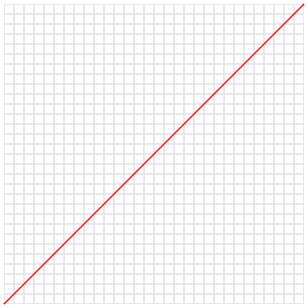
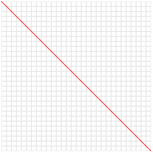
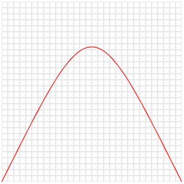
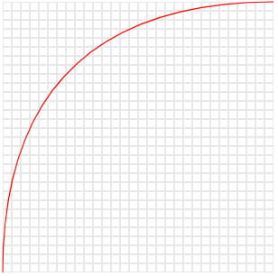
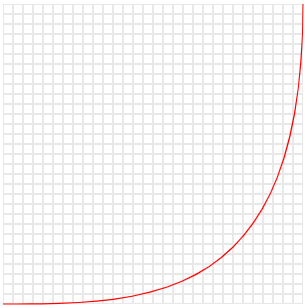
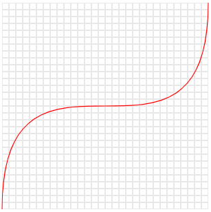
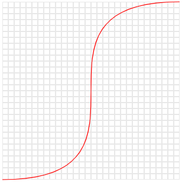

Random number generator with custom distribution
==============
Standard PHP functions like `rand` or `mt_rand` generate random numbers with normal distribution, however sometimes it 
required to generate random numbers with different distribution, for example (binomial distribution)[https://en.wikipedia.org/wiki/Binomial_distribution].


Installation
------------
```bash
composer require qmegas/php-rand-custom-distribution
```

Requirements
------------
PHP >= 7.0

Simple Example
--------------
```php
$generator = new \Qmegas\RandomGenerator(50, 150, function(float $i) {
	return $i * 100;
});
echo $generator->getNumber();
```
Class constractor receives 3 arguments: low-high bounds of generated numbers and distribution function.
Distribution function receives float argument between 0 and 1 and should return some integer value >= 0, see additional examples for better understanding.

Some Additional Examples
--------------
<table>
	<tr>
		<td>Normal Distribution</td>
		<td>
			<pre lang="php">$generator = new \Qmegas\RandomGenerator($min, $max, function() {
	return 1;
});</pre>
		</td>
	</tr>
	<tr>
		<td></td>
		<td>
			<pre lang="php">$generator = new \Qmegas\RandomGenerator($min, $max, function(float $i) {
	return $i * 100;
});</pre>
		</td>
	</tr>
	<tr>
		<td></td>
		<td>
			<pre lang="php">$generator = new \Qmegas\RandomGenerator($min, $max, function(float $i) {
	return (1 - $i) * 100;
});</pre>
		</td>
	</tr>
	<tr>
		<td></td>
		<td>
			<pre lang="php">$generator = new \Qmegas\RandomGenerator($min, $max, function(float $i) {
	return (1 - $i) * 200 * $i;
});</pre>
		</td>
	</tr>
	<tr>
		<td></td>
		<td>
			<pre lang="php">$generator = new \Qmegas\RandomGenerator($min, $max, function(float $i) {
	return (2 * (1 - $i) * ($i ** 0.5) + ($i ** 2)) * 100;
});</pre>
		</td>
	</tr>
	<tr>
		<td></td>
		<td>
			<pre lang="php">$generator = new \Qmegas\RandomGenerator($min, $max, function(float $i) {
	return ($i ** 3) * 100;
});</pre>
		</td>
	</tr>
	<tr>
		<td></td>
		<td>
			<pre lang="php">$generator = new \Qmegas\RandomGenerator($min, $max, function(float $i) {
	return (3 * ((1 - $i) ** 2) * $i + ($i ** 3)) * 100;
});</pre>
		</td>
	</tr>
	<tr>
		<td></td>
		<td>
			<pre lang="php">$generator = new \Qmegas\RandomGenerator($min, $max, function(float $i) {
	return (1 / (1 + exp(-10 * ($i - 0.5)))) * 100;
});</pre>
		</td>
	</tr>
</table>